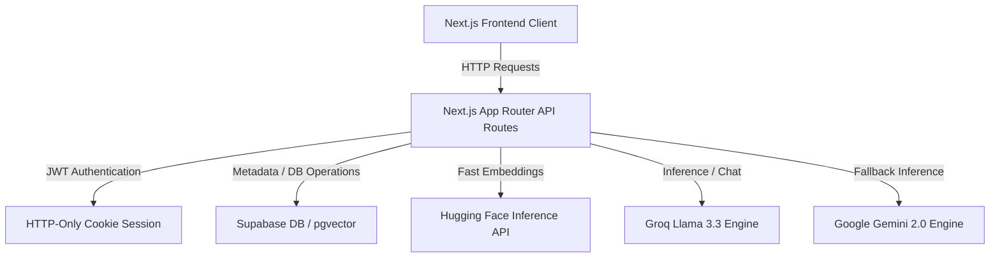

# LearnSphere AI — System Documentation

LearnSphere AI is a premium, high-performance study and document ingestion platform powered by Next.js, Supabase, and advanced AI models. This document serves as the official guide to the platform's architecture, key features, database schema, and custom optimizations.

---

## 1. System Architecture Overview

The platform uses a modern, lightweight, serverless-ready stack:



* **Frontend**: Next.js App Router, styled with dynamic CSS and Micro-animations.
* **Database & Vector Search**: Supabase with the `pgvector` extension for semantic document search.
* **Embeddings**: Batch processing through the Hugging Face Inference API (`sentence-transformers` model).
* **AI Engine**: Groq Cloud (`llama-3.3-70b-versatile`) for ultra-low latency chat/quiz generation, with a fallback to Google Gemini (`gemini-2.0-flash`).
* **Session Management**: Direct JWT authentication backed by real-time Supabase profile checks, with Redis removed for increased system reliability.

---

## 2. Key Optimizations & Features

### 🚀 2.1. Batch Embedding Pipeline (`lib/db/ingestion.ts`)
Previously, document ingestion generated embeddings sequentially (one chunk at a time), causing network latency issues and route timeouts for large PDFs.
* **Optimization**: Implemented a chunk-batching pattern. Texts are grouped into batches of **32 chunks** per request to Hugging Face.
* **Result**: Ingestion speeds improved by **over 10x**, allowing documents with hundreds of pages to ingest in seconds without timeout risks.

### 📄 2.2. Intelligent Multi-Page Summarization (`app/api/summarize/route.ts`)
Large PDFs were previously hitting context limits or generating summaries composed entirely of top-of-page metadata headers.
* **Optimization**: Implemented a **spread-sampling strategy**. The route fetches all sections and samples up to 25 segments distributed evenly across the entire length of the document.
* **Result**: Generates balanced, complete summaries representing the entire text instead of just the first few pages.

### 🔍 2.3. Scanned PDF & Sparse Document Fallbacks
When a user uploads a scanned or image-based PDF, traditional parsers only extract structural text headers or empty strings.
* **Detection**: The system counts word frequencies and text density. If character length is `< 500` or contains predominantly recurring header stamps (e.g. author name, watermark), it flags the document as `isSparse`.
* **Summary Fallback**: Instead of displaying a blank summary, the system automatically uses its general knowledge to create a comprehensive study guide based on the document's title (e.g. *Averages*).
* **Chat Fallback**: The AI explainer switches to answering questions using general knowledge, prepending a polite notice: `*(Note: This document appears to be scanned, so I am answering using general knowledge.)*`.

### 💅 2.4. Real-time Markdown & Citation Parser (`app/page.tsx`)
Rather than rendering raw text blocks filled with raw markdown characters (`**`, `###`, `-`), the client now formats text in real-time.
* **Custom React Parser**: Replaced heavy markdown packages with a lightweight React parser (`parseMarkdown`).
* **Features**: Renders headers, lists (ordered/unordered), bold, and italics.
* **Interactive Citations**: Dynamically extracts source markers like `[Source 1]` and converts them into styled interactive badges:
  $$\text{[Source 1]} \longrightarrow \text{Source 1 Badge}$$

### 🔐 2.5. Real-Time Account Database Sync (`app/api/auth/me/route.ts`)
To prevent the client from displaying stale details (such as profile names or emails cached inside cookies), user profile queries are served directly from the database.
* **Implementation**: Decrypts the user ID from the secure JWT cookie and queries the live `users` table in Supabase.

---

## 3. Database Schema

The Postgres database on Supabase is structured as follows:

| Table | Column | Type | Description |
| :--- | :--- | :--- | :--- |
| **`users`** | `id` | `UUID` (PK) | Unique identifier for the user |
| | `email` | `VARCHAR` (Unique)| User email address |
| | `name` | `VARCHAR` | User display name |
| | `password_hash` | `TEXT` | Bcrypt password hash |
| **`documents`** | `id` | `UUID` (PK) | Unique identifier for the document |
| | `title` | `TEXT` | Document title |
| | `created_at` | `TIMESTAMPTZ` | Upload timestamp |
| **`document_sections`** | `id` | `UUID` (PK) | Section identifier |
| | `document_id` | `UUID` (FK) | Reference to `documents` |
| | `content` | `TEXT` | Raw text segment content |
| | `embedding` | `vector(384)` | Semantic vector representation |
| **`user_reading_progress`** | `id` | `UUID` (PK) | Progress identifier |
| | `user_id` | `UUID` (FK) | Reference to `users` |
| | `document_id` | `UUID` (FK) | Reference to `documents` |
| | `progress_percent` | `INTEGER` | Reading progress percentage |
| **`quiz_attempts`** | `id` | `UUID` (PK) | Quiz log identifier |
| | `user_id` | `UUID` (FK) | Reference to `users` |
| | `document_id` | `UUID` (FK) | Reference to `documents` |
| | `score` | `INTEGER` | Correct answers |
| | `total_questions` | `INTEGER` | Total questions asked |

---

## 4. API Reference

All routes are fully optimized Next.js App Router dynamic API routes:

* **`POST /api/auth/signup`**: Creates a new user account and hashes passwords.
* **`POST /api/auth/login`**: Authenticates credentials and sets an HTTP-only JWT `token` cookie.
* **`GET /api/auth/me`**: Decrypts the token cookie and queries Supabase to return the live user profile.
* **`POST /api/auth/logout`**: Clears the authentication token cookie.
* **`POST /api/ingest`**: Parses uploaded PDFs, slices text into logical chunks, batches them through HuggingFace, and stores them in Supabase with vector embeddings.
* **`POST /api/summarize`**: Generates a spread-sampled overview of the document (or falls back to a general study guide for scanned PDFs).
* **`POST /api/chat`**: Streams low-latency responses matching the user's doubt, inserting semantic sources.
* **`POST /api/search`**: Performs `pgvector` cosine similarity matching against the document sections.
* **`POST /api/quiz/generator`**: Leverages Groq/Gemini to produce dynamic multiple-choice quizzes, ignoring metadata stamps.

---

## 5. Development & Deployment

### Environment Variables (`.env.local`)
```env
# Database Credentials
SUPABASE_URL="https://your-project.supabase.co"
SUPABASE_SERVICE_ROLE_KEY="your-secret-role-key"

# AI Inference Keys
GROQ_API_KEY="gsk_..."
GOOGLE_GENERATIVE_AI_API_KEY="AIzaSy..."

# Embedding Engine Token
HF_TOKEN="hf_..."

# Authentication Security
JWT_SECRET="your-jwt-secure-signing-key"
```

### Local Dev Server
```bash
# Start development server
npm run dev

# Run TypeScript compilation check
npx tsc --noEmit

# Compile production bundle
npm run build
```
